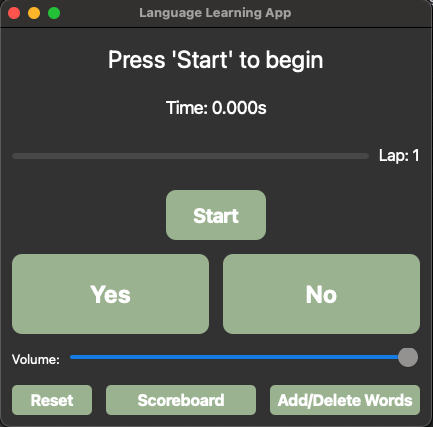
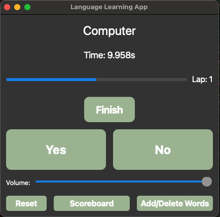
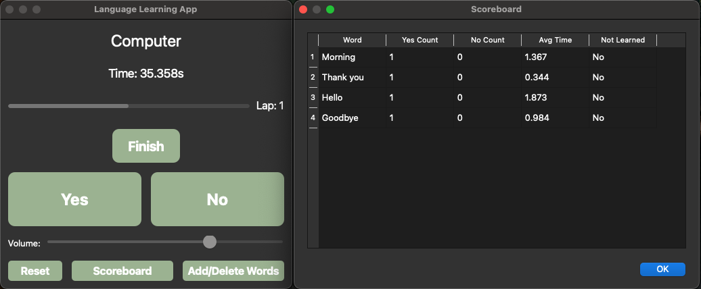
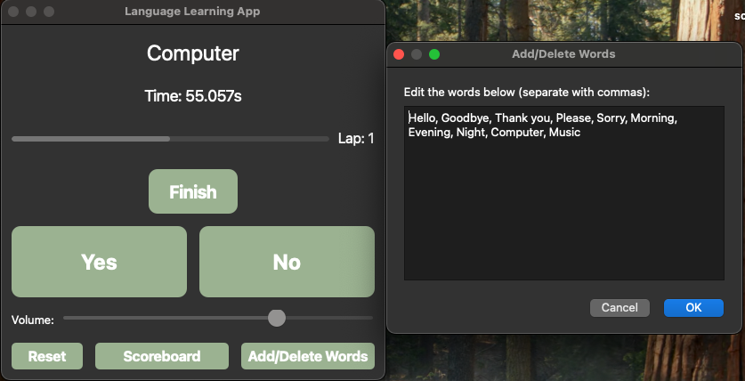

# Language Learning App

A simple yet effective **language learning app** built with Python using **PyQt5** for the user interface and **pygame** for sound effects. This app allows users to practice vocabulary, track their progress, and improve their language skills interactively.


[](https://www.youtube.com/watch?v=yDH6p7qp3AA)

A simple yet effective **language learning app** built with Python using **PyQt5** for the user interface and **pygame** for sound effects. This app allows users to practice vocabulary, track their progress, and improve their language skills interactively.

---

## 📽️ Demo Video

Watch the full demo of the app on YouTube:

[](https://www.youtube.com/watch?v=yDH6p7qp3AA)

---

## 📷 Screenshots

Here are some screenshots of the app in action:

### 1. Main Interface


### 2. Word Interaction


### 3. Scoreboard


### 4. Manage Words


---

## ✨ Features

- **Interactive Vocabulary Practice**: Add, delete, and manage words.
- **Scoreboard Tracking**: Keep track of your progress with stats like `Yes Count`, `No Count`, and `Average Time`.
- **Sound Effects**: Custom sound effects for various interactions (e.g., reset, correct/incorrect answers).
- **Lap Counter & Progress Bar**: Shows your progress and resets automatically after completing a lap.
- **Fully Customizable UI**: Adjust volume, button styles, and app colors.
- **Sortable Scoreboard**: Click column headers to sort stats dynamically.

---

## 🚀 Installation

1. **Clone the Repository**
   ```bash
   git clone https://github.com/YourGitHubUsername/Language-vocab-improving-app.git
   cd Language-vocab-improving-app


2. **Install depencencies**
   ```bash
   pip install -r requirements.txt

3. **Run the app**
   ```bash
   python main.py


##🛠️ Usage

-Start the App: Click "Start" to begin.
-Practice Words: Use "Yes" or "No" to record whether you remembered a word.
-Manage Words: Add or delete words using the "Add/Delete Words" button.
-Track Progress: Check the "Scoreboard" for detailed statistics.
-Reset Data: Use the "Reset" button to clear all progress.


Contributions are welcome! Feel free to fork this repository, make improvements, and submit a pull request.

This project is licensed under the MIT License. See the LICENSE file for details.


